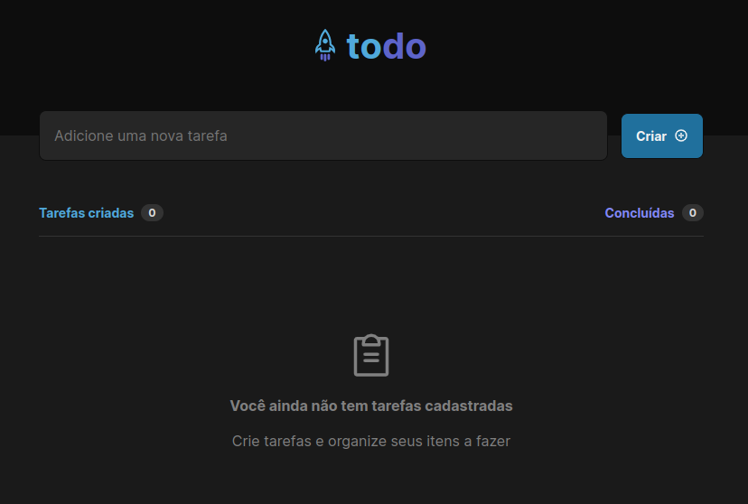
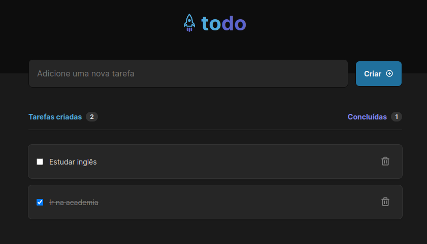

# ToDo-app
Aplicação para controle de tarefas a serem realizadas.


* O objetivo é desenvolver o front-end, utilizando **React** de uma aplicação que gerencia a execução de tarefas para uso pessoal.

</br>




</br>
</br>


### Recursos
Descrição dos principais itens contidos no desenvolvimento da aplicação:

* React
* Vite
* Typescript
* CSS Modules
* [Framer Motion](https://www.framer.com/motion/)

Aplicando aqui conceitos de estado, imutabilidade, componentização, animação, propriedade, comunicação entre componentes e outros.

</br>

### Executar
Sequência de passos para executar a aplicação: </br>
- **Requisitos:** *Node.js*

```bash
# Clonar repositório
$ git clone https://github.com/leodoima/todo-app.git

# Ir para pasta raiz do projeto
$ cd todo-app

# Instalar as dependências da aplicação
$ npm install

# Executar aplicação
$ npm run dev

# Acessar o recurso
$ http://localhost:5173/
```

</br>

